# 项目手册

本手册主要介绍 [TensorAtom](https://github.com/TensorAtom)/[Graph](https://github.com/TensorAtom/Graph) 项目的创建的基础以及如何使用该项目完成计算机图形的相关操作。

可以直接使用 PyPI 的安装方式进行安装：

```sh
$ pip install graph-tensor
```

之后的使用需要载入：

```python
import graph_tensor
```

## 1. 设计的基础

一般地，在数学中使用一个向量 $x=(x_0,x_1,\cdots,x_{n-1}) \in \mathbb{R}^n$ 来描述空间中的一个**点**（即 ●）；使用向量的减法表示一个**有向线段** $c = a - b$，即 $c$ 是由点 $b$ 指向点 $a$ 的有向线段（这里并不严谨）。考虑到计算机的离散特性，我们很难获取连续的“点”，故而，我们转向使用小方块 ■ 表示“点”（即图像的像素点）。这些 ■ 以不同的方式进行组合排列出不同的图案，比如线段、矩形框、椭圆、圆锥等。

我们先研究二维平面的点。

## 2. 画布：Canvas

这些点总是需要一个“承载”容器，在数学中，一般称其为坐标系或者参考系。笛卡尔坐标系为大家所熟知，在三维空间中一般被分为左手系和右手系。由于本项目讨论的坐标系是基于 tkinter 的 Canvas 模块，而 Canvas 的坐标系可以看作是左手系的二维版本，即：水平向右表示 $x$ 轴的正方向，竖直向下表示 $y$ 轴的正方向。

因为“点动成线，线动成面，面动成体”，所以我们可以使用 ■ 在 Canvas 画出各种各样的二维图像元素。为了定制统一化的图形元素，我们指定有向线段 $\text{direction}=(x_0,y_0,x_1,y_1)$ 为全部图形元素的基本属性，其中 $(x_0,y_0)$ 表示起点，$(x_1,y_1)$ 表示终点。

可以运行如下代码看几个常见的图形元素：

```python
from graph_tensor.graph.atom import Meta


def test_meta(direction = (20, 20, 220, 300)):
    from tkinter import Tk
    root = Tk()
    self = Meta(root, width=250, height=400, background='white')
    self.draw_graph(direction, 'Rectangle', 'blue', line_width=10)
    self.draw_graph(direction, 'Oval', 'red', line_width=10)
    self.draw_graph(direction, 'Arc', 'green', line_width=10, arc_style='pieslice')
    self.draw_graph(direction, 'Line', 'black',line_width=10)
    self.layout()
    root.mainloop()

test_meta()
```

显示的效果见图1：

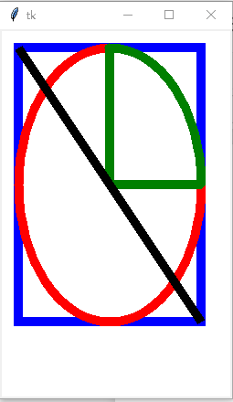

图1 显示了红色的椭圆、绿色的扇形、蓝色的矩形、黑色的线段。从图中可以观察到给定相同的 `direction`，画出的图形元素有着相同的中心。从本质上讲，`direction` 可以看作是椭圆、扇形、矩形以及线段的方向向量。只要给定 `direction`，那么它们之间的关系就被牢牢的锁定了。

这里的 `Meta` 没有直接提供画“多边形”的方法，其实画“多边形”可以由画“线段”组合得到。下面给出代码实现：

```python
from tkinter import Tk

def point2polygon(points):
    '''将点列转换为首尾相接的线段'''
    directions = []
    for start, end in zip(points, points[1:]):
        directions.append((*start, *end))
    directions.append((*points[-1], *points[0]))
    return directions

def draw_polygon(meta, *directions):
    '''画出多边形'''
    for direct in directions:
        meta.draw_graph(direct, 'Line', 'black', fill='red', line_width=5)

root = Tk()
self = Meta(root, width=250, height=400, background='white')

points = [
    (20, 20), (30, 50), (100, 250),
    (250, 340), (220, 230)
]
directions = point2polygon(points)
draw_polygon(self, *directions)
self.layout()
root.mainloop()
```

效果图见图2：

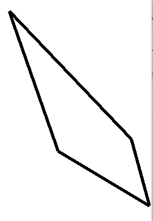

您也可以使用 `self.create_polygon(points, fill='red')` 画出有内部填充的多边形。可以使用如下代码画出虚线图形（需要指定参数 `dash`）：

```python
def test_meta_dash(direction = (20, 20, 220, 300)):
    from tkinter import Tk
    root = Tk()
    self = Meta(root, width=250, height=400, background='white')
    self.draw_graph(direction, 'Rectangle', 'blue', line_width=10, dash=5)
    self.layout()
    root.mainloop()

test_meta_dash()
```

效果见图3：

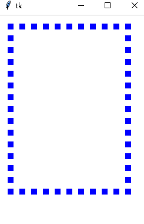

我们无需关注 `Canvas.create_line`、`Canvas.create_arc`、`Canvas.create_rectangle`、`Canvas.create_oval` 等的具体实现原理，直接从其实现的效果来看，这些方法基本实现了“点动成线，线动成面”的思想。

## 3 张量

由于 `Canvas` 没有提供直接画点的方法，所以需要我们自定义。在此之前，我们回顾一下数学中对“点”（或者说是向量、张量）在笛卡尔积中的定义即为多维数组：$x = (x_0, x_1, x_2, \cdots, x_{n-1})$。张量 $x$ 分量可以使用下标进行索引，比如 $x_3 = x[3]$。

一般地，张量有模长和方向，模长可以记作 $||x||$（即范数），而方向可以使用方向角 $\theta = (\theta_0, \theta_1, \theta_2 \cdots, \theta_{n-1})$ 表示，其中 $\theta_j \in (-\pi, \pi)$。这样张量也可以表示为 $x =  \theta ||x||$。下面仅仅讨论二维张量。

下面考虑 Canvas 的 `Line`（即有向线段），我们可以定义为从点 $a$（被称为起点）到点 $b$（被称为终点）之间的张量之差：$b-a$。前面已经讨论了如何画线段，现在我们使用 `line_width` 参数验证“线动成面”的效果。首先设计如下一个类：

```python
class Line:
    def __init__(self, start_point, end_point, line_width=5):
        self.start_point =  start_point
        self.end_point =  end_point
        self.line_width = line_width

    def run(self):
        from tkinter import Tk
        root = Tk()
        direction = (*self.start_point, *self.end_point)
        meta = Meta(root, width=200, height=200, background='blue')
        meta.draw_graph(direction, 'Line', 'white', line_width=1)
        direction1 = list(direction)
        direction1[0] += 20
        direction1[2] += 20
        meta.draw_graph(direction1, 'Line', 'red', line_width=self.line_width)
        [meta.draw_graph((direction[0]+40+k, direction[1], direction[2]+40+k, direction[3]), 
                         'Line', 'yellow', line_width=1) for k in range(self.line_width)]
        y_stride = direction1[3] - direction1[1]
        [meta.draw_graph((direction1[0]+k-2, direction1[1]+y_stride, direction1[2]+k-2, direction1[3]+y_stride),
                         'Line', 'yellow', line_width=1) for k in range(self.line_width)]
        meta.layout()
        root.mainloop()
```

这个类很好理解，我们直接看其调用的效果。先看看竖直线的效果：

```python
start_point, end_point = (20, 20), (20, 100)
line = Line(start_point, end_point, line_width=5)
line.run()
```

显示如下图4：

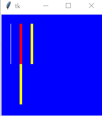

从图4 可以看出水平堆叠 `line_width` 线宽为1 的白线得到的黄线与设定线宽为 `line_width` 的红线是等宽和等高的。换言之，参数 `line_width` 实现了“线动成面”的效果。如果我们改变终点（即改变线段的方向）：

```python
start_point, end_point = (20, 20), (100, 100)
line = Line(start_point, end_point, line_width=5)
line.run()
```

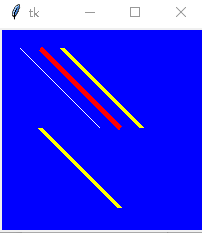

为了让堆叠 `line_width` 线宽为1 的白线与设定线宽为 `line_width` 的红线相同，需要改变线段堆叠的方向为"ne"（即西北方向），这里就不放具体的代码了。

## 4 位移

在物理学中常常使用“位移”来描述物体相对位置的变动，故而引入“位移”的概念有助于我们理解和操纵 Canvas 的对象。使用代码实现：

```python
class Graph:
    def __init__(self, meta):
        self.meta = meta

    def move(self, graph_id, displacement):
        '''Move objects along displacement

        :param graph_id: The identifier of graph.
        :param displacement: The concept of representing the displacement in physics.
        '''
        self.meta.move(graph_id, *displacement)

# 测试
def test_Graph(direction, displacement, line_width=7):
    from tkinter import Tk
    root = Tk()
    meta = Meta(root, width=200, height=200, background='blue')
    graph = Graph(meta)
    graph_id = graph.meta.draw_graph(direction, 'Line', 'white', line_width=line_width)
    graph.move(graph_id, displacement)
    graph.meta.draw_graph(direction, 'Line', 'red', line_width=line_width)
    meta.layout()
    root.mainloop()

direction = (20, 20, 100, 100)
displacement = (-10, 10)
test_Graph(direction, displacement)
```

效果图见图6：

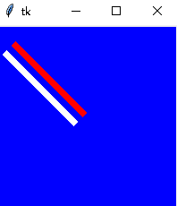

图6 中的红色图形对象沿着 (-1, 1) 方向移动到 10 个像素到白色图形对象位置。

## 5 画点

在数学中点是没有大小的（因为实数充满了整个数轴）即是连续的，而计算机处理的数字图像是离散的，换言之，像素点是有大小的，即像素点是一个 $1 \times 1$ 的小方块：

```python
from tkinter import Tk
root = Tk()
meta = Meta(root, width=200, height=200, background='blue')
origin_x, origin_y = 0, 0
start_points = [(origin_x+k, origin_y+k) for k in range(10, 200, 5)]
end_points = [(origin_x+k+1, origin_y+k) for k in range(10, 200, 5)]
graphs = [meta.draw_graph(direct, 'Line', 'white', line_width=1) for direct in zip(start_points, end_points)]
meta.layout()
root.mainloop()
```

效果图见图7：


可以说数字图像都是由这些“小方块”堆叠而成的。该例子形象地说明了线是由点构成的。但是这种画法有点繁琐，改变点的大小也很麻烦。为了更方便的画“点”，我们可以使用 Rectangle 和 Oval 来画点。

## 5.1 方点 ■

前面我们已经知道移动 `Line` 可以画出矩形，但是具体操作起来有点复杂，需要自行设计 `line` 的移动轨迹。为了方便构建矩形，Canvas 已经设计了一个函数 `create_rectangle`。我们也改变 `line_width` 来看看它们有何不同：

```python
root = Tk()
direction = (20, 20, 120, 120)
direction1 = (120, 20, 220, 120)
direction2 = (20, 120, 120, 220)
meta = Meta(root, width=500, height=500, background='green')
meta.draw_graph(direction, 'Rectangle', 'red', line_width=20, fill='black')
meta.draw_graph(direction1, 'Rectangle', 'white', line_width=1, fill='yellow')
meta.draw_graph(direction2, 'Rectangle', 'white', line_width=1, fill='yellow')
meta.layout()
root.mainloop()
```

显示效果见图8：

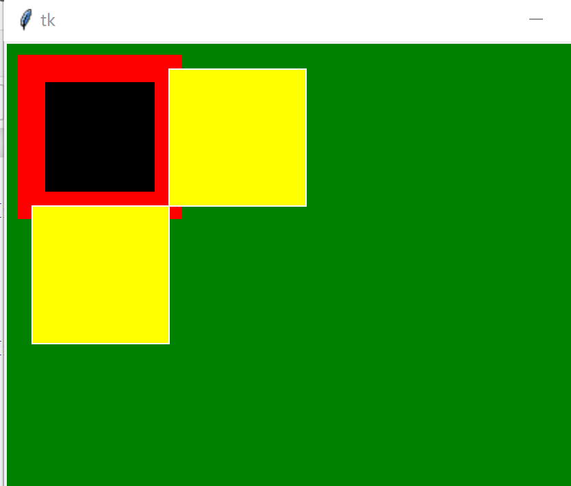

图8 可以看出矩形的 `line_width` 参数是以线宽为 1 的矩形为基准中心，向内、向外均扩展 `int(line_width/2)` 个像素。考虑到本项目是为了研究图形学相关的理论的，故而为了简化问题，今后默认 `line_width` 为 1。这样，我们可以把矩形看作是 $1\times 1$ 的像素块 ■ 堆叠而成的，而不考虑是 `Line` 堆叠而成的。为什么要这么设定呢？因为这样的设定将会更方便我们今后对图形的研究。比如说，按照像素块的堆叠思想我们可以将 $2\times 1$ 或者 $2\times 2$ 的“大”矩形视为“超像素”，然后可以仅仅研究“超像素”来进一步地简化问题。

我们再考虑 `meta.draw_graph` 的参数 `direction`，可以将其当作是“位移”即：$h \times w$ 的矩形可以看作是 $1\times 1$ 的像素块 ■ 先水平向右移动 $w$ 个像素滑动得到一个 $1 \times w$ 的“线段”，最后此“线段”竖直向下移动 $h$ 个像素滑动得到的。这里的**位移**（displacement）可以记作 $(w, h)$，其中 $|w|$ 和 $|h|$ 分别被称为矩形的**宽**和**高**。由于 $w$ 和 $h$ 是可正可负的，所以矩形也是**有方向的**，即 $(w, h)$ 指定了矩形的方向和大小。

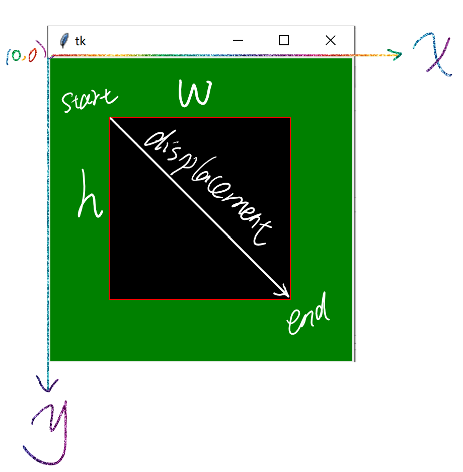


基于像素或者超像素的思想便可以定义“点”（即方点）：点是一个有起点 $a$ 和方向 $(w, h)$（这里 $|w|=|h|=1$）。

综上所述，我们便可以看出像素（pixel）是数字图像的最小单元。同时我们可将像素视作之前介绍的张量。

```python
root = Tk()
direction = (160, 100, 160, 100)
meta = Meta(root, width=300, height=300, background='blue')
meta.create_line((0, 0, 160, 100), arrow='last', width=2)
meta.draw_graph(direction, 'Rectangle', 'white', line_width=2)
meta.create_text((175, 115),
                 text='Tensor\ndisplacement is (160, 100)',
                 fill='yellow')
meta.layout()
root.mainloop()
```

效果图见图10：

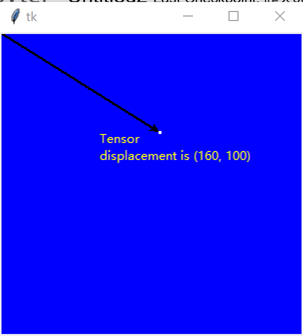

## 5.2 圆点 ●

使用 Oval 看看改变 `line_width` 的不同⚪：

```python
root = Tk()
direction = (20, 20, 120, 120)
direction1 = (120, 20, 220, 120)
direction2 = (20, 120, 120, 220)
meta = Meta(root, width=500, height=500, background='green')
meta.draw_graph(direction, 'Oval', 'red', line_width=20, fill='black')
meta.draw_graph(direction1, 'Oval', 'white', line_width=1, fill='yellow')
meta.draw_graph(direction2, 'Oval', 'white', line_width=1, fill='yellow')
meta.layout()
root.mainloop()
```

效果见图11：

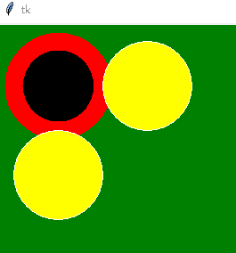

可以看出 Oval 也是中心填充 `line_width` 的。

同样，也可以使用 Oval 画出“点”：

```python
root = Tk()
direction = (160, 100, 160, 100)
meta = Meta(root, width=300, height=300, background='blue')
meta.create_line((0, 0, 160, 100), arrow='last', width=1)
meta.draw_graph(direction, 'Oval', 'white', line_width=2)
meta.create_text((175, 115),
                 text='Tensor\ndisplacement is (160, 100)',
                 fill='yellow')
meta.layout()
root.mainloop()
```

效果见图12：

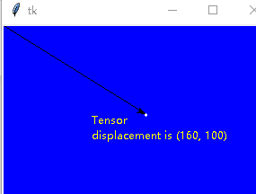
